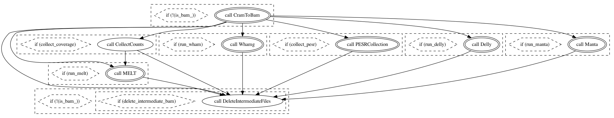
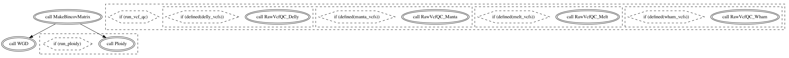
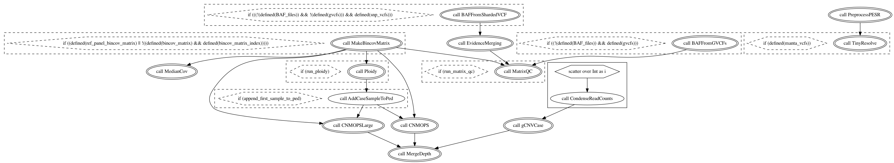
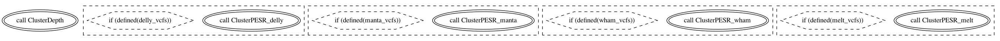

# GATK-SV

- [GATK-SV](#gatk-sv)
  - [Module00 - Preprocessing](#module00---preprocessing)
    - [Ploidy estimation & sex inference](#ploidy-estimation--sex-inference)
    - [Sequencing dosage bias scoring](#sequencing-dosage-bias-scoring)
    - [Sample QC](#sample-qc)
    - [Sample batching](#sample-batching)
    - [Execution of SV discovery algorithms](#execution-of-sv-discovery-algorithms)
    - [Module00a](#module00a)
    - [Module00b](#module00b)
    - [Module00c](#module00c)
  - [Module01](#module01)

## Module00 - Preprocessing

First collect required data & metadata, then perform the next steps.

### Ploidy estimation & sex inference

- read depth in 1Mb bins:
  - exclude bins with no coverage in >5% samples
  - normalise sample coverage by:
    `tot cov per bin / median across all autosomal bins`
- per-chrom ploidy
  - 2x median normalised coverage per bin
- sex inference:

  - round sex chrom ploidy to nearest integer copy state

### Sequencing dosage bias scoring

- confounded CNV calling due to highly non-uniform coverage
- antipodal between PCR- and PCR+ protocols
- WGD package controls for dosage bias:
  - theta metric summarises directionality and magnitude of bias per sample

### Sample QC

- Median 100bp bin coverage
- Dosage bias score theta: measurement of coverage uniformity with WGD.
- Autosomal ploidy spread: diff between highest/lowest ploidies for any two
  autosomes.
- Z-score of outlier 1Mb bins: median absolute Z-score of number of 1Mb bins per
  chromosome with normalised CN estimates < 1.5 or >2.5 Z-scores were calculated
  separately for PCR+ and PCR- samples.
- Chimera rate: percentage of chimeric read pairs in total read pairs.
- Pairwise alignment rate: percentage of read pairs where both reads aligned
  successfully.
- Library contamination: max value of adapter or est. sample contamination
  fraction.
- Read length: mean read length
- Ambiguous sex genotypes: normalised CN est. for chrX & chrY; ambiguous if
  `X ~ (1.1, 1.9)` and `Y ~ (0.1, 0.9)`
- Discordant inferred & reported sex

### Sample batching

- split by PCR status (PCR+/PCR-) (`2 groups`)
- split by chrX ploidy (`2 * 2 groups`)
  - `>=2` chrX copies: female
  - `<2` chrX copies: male
- split into median 100bp binned coverage quartiles (`2 * 2 * 4 = 16 groups`)
  (**up to here we have matched samples based on PCR status, sex, and
  coverage**)
- rank all samples by theta inside each of the 16 groups and split into groups
  of ~100 samples each.
- run cn.MOPS on these ~100 sample batches
- merge every two ~100 male sample batches with corresponding two ~100 female
  sample batches, giving batches of ~400 samples.

### Execution of SV discovery algorithms

- Split reads (SR), anomalous paired-end reads (PE), and read depth (RD).
- **Manta**:
  - best all-round performer
  - v1.0.3 in single-sample mode with default params
- **DELLY**:
  - maximises sensitivity for small and balanced SVs
  - v0.7.7 in single-sample mode for del/dup/ins/inv
- **MELT**:
  - captures mobile element insertions (MEIs) with high sensitivity
  - v2.0.5 in single-sample mode
- **cn.MOPS**:

  - flexible RD-based algo for cohorts with high sensitivity for rare CNVs.
  - custom implementation of v1.20.1 in ~100 sample batches
  - compose coverage matrixes across all samples at 300bp and 1000bp resolution,
    exclude samples with median bin coverage of zero per contig, then run
    cn.MOPS, split raw calls per sample, segragate calls into dels (CN < 2) and
    dups (CN > 2), merge 300bp + 1000bp calls per sample per CNV type using
    bedtools merge, and subtracted N-masked bases from CNV calls using bedtools
    subtract.

- After getting raw SV calls from four tools above, use
  [svtk](https://github.com/talkowski-lab/svtk) modules (now within GATK-SV) to
  standardise the VCF/BED files.
- Collect PE, SR, RD and SNP B-allele frequency (BAF) evidence per sample.
  - PE & SR: `svtk collect-pesr`
  - RD: `binCov`
  - BAF: `vcf2baf` on GATK HaplotypeCaller VCFs
- Construct PE, SR, RD, and BAF matrices merged across all samples in each
  400-sample batch.

### Module00a

### Module00b

### Module00c

## Module01

